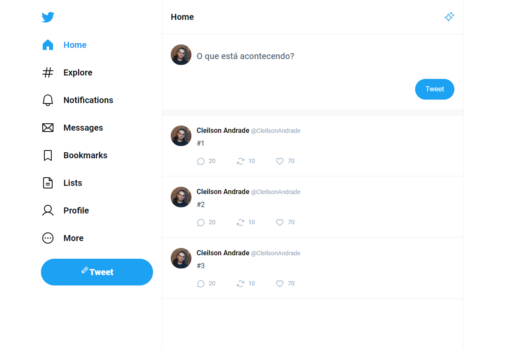

<div align="center">
  <h1>UI Twitter</h1>
  <p>Clone da interface do Twitter, com capacidade de postar tweets, timeline e comentar tweets específicos. Desenvolvido com React com TypeScript, a fim de estudos sobre tipagem estática e componentização, com rotas utilizando a lib React Router DOM.</p>
  
</div>

# 📒 Índice
* [Descrição](#descrição)
* [Requisitos Funcionais](#requisitos)
  * [Features](#features)
* [Tecnologias](#tecnologias)
* [Design](#design)
  * [Cores](#cores)
  * [Fontes](#fontes)
  * [Ícones](#ícones)
* [Instalação](#instalação)
* [Licença](#licença)

# 📃 <span id="descrição">Descrição</span>
Clone da interface do Twitter, com capacidade de postar tweets, timeline e comentar tweets específicos. Desenvolvido com [**React**](https://react.dev/) com [**TypeScript**](https://www.typescriptlang.org/), a fim de estudos sobre tipagem estática e componentização, com rotas utilizando a lib [**React Router DOM**](https://reactrouter.com/en/main) e salvamento dos tweets localmente com a lib [**localforage**](https://github.com/localForage/localForage) e classificação na timeline por data com [**match-sorter**](https://github.com/kentcdodds/match-sorter) e [**sort-by**](https://github.com/kvnneff/sort-by).

# 📌 <span id="requisitos">Requisitos Funcionais</span>
- [x] Postar tweets<br>
- [x] Visualização de uma timeline de tweets<br>
- [x] Capacidade de comentar um tweet especifico<br>
- [x] Visualização de um timeline para os comentários de um tweet especifico<br>

## Features
- [x] Responsividade<br>

# 💻 <span id="tecnologias">Tecnologias</span>
- **HTML**
- **CSS**
- **JavaScript**
- **TypeScript**
- **Vite**
- **ReactJS**
- **localforage**
- **match-sorter**
- **React Router DOM**
- **sort-by**

# 🎨 <span id="design">Design</span>
- O modelo final para versão desktop e mobile está disponível na pasta `./design`

- <span id="cores">Cores<br></span>
  * #1da1f2<br>
  * #0f1419<br>
  * #ebeef8<br>
  * #5b7083<br>
  * #fff<br>
  * #ebeef0<br>
  * #f7f9fa<br>
  * #89a2b8<br>

- <span id="fontes">Fontes<br></span>
  * Roboto, sans-serif

- <span id="ícones">Ícones<br></span>
  * Phosphor React

# 🚀 <span id="instalação">Instalação</span>
```bash
  # Clone este repositório:
  $ git clone https://github.com/CleilsonAndrade/ui-twitter.git
  $ cd ./ui-twitter

  # Instalar as dependências:
  $ yarn install

  # Executar:
  $ yarn dev
```

# 📝 <span id="licença">Licença</span>
Esse projeto está sob a licença MIT. Veja o arquivo [LICENSE](LICENSE) para mais detalhes.

---

<p align="center">
  Feito com 💜 by CleilsonAndrade
</p>
